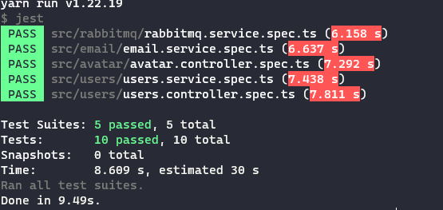
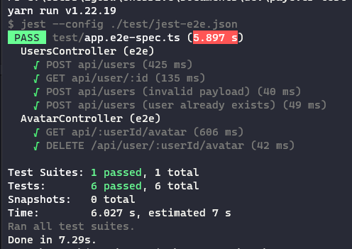

# Payever Test

This project is created to test the Payever backend vacancy.

## Getting Started

These instructions will help you get a copy of the project up and running on your local machine for development and testing purposes.

### Prerequisites

To run this project, you need to have Docker installed on your machine. If you don't have Docker installed, you can download and install it from the official website: [Docker](https://www.docker.com/)

### Installing

To get started, follow these steps:

1. Clone this repository to your local machine:

   ```bash
   git clone https://github.com/IgorVVieira/payever-test.git
   ```

2. Change into the project directory:

   ```bash
   cd payever_test
   ```

3. Build and run the project using Docker Compose:
   ```bash
     docker-compose up
   ```
4. The project will now be running on your local machine.

### Test in Postman

I left a file with the collection in the postman to facilitate the tests, available at:
[Collection](/postman/Users.postman_collection.json)


### Running Unit Tests

To run the unit tests for this project, you can use the following command:

```bash
yarn test
````

### Running End-to-End (E2E) Tests

To run the end-to-end tests for this project, you can use the following command:

```bash
yarn test:e2e
```

### Evidences
Observation: I had problems creating a mock fs to test avatar.service, I couldn't solve it for a while. I apologize for that.

#### Unit

#### E2E


### Requirements

- [x] The project passes ESLint checks.
- [x] The project builds and starts successfully.
- [x] All endpoints can be successfully requested using Postman.
- [x] Data is stored in the database successfully, and RabbitMQ events are emitted.
- [x] The application is well-covered with unit and functional tests.
